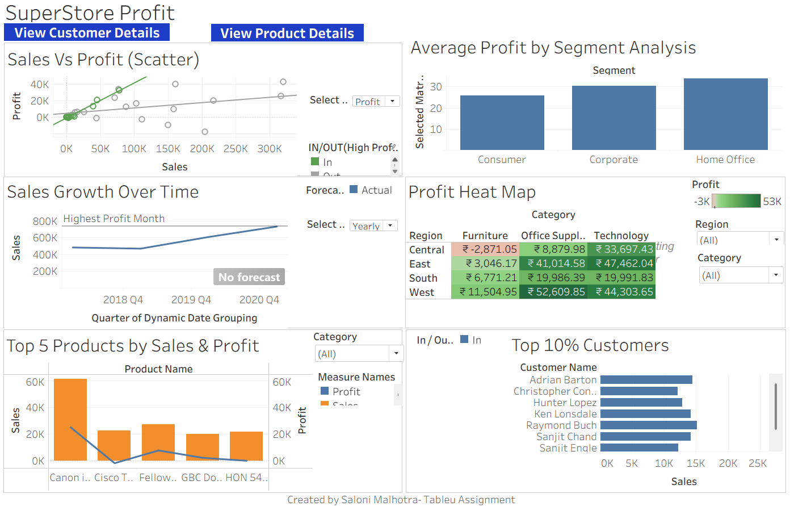

# Tableau_Superstore_dashboard
Interactive Tableau dashboard analyzing sales, profit, and quantity trends from the Sample Superstore dataset with regional, product, and customer insights.

## 📊 Key Features
- 3 interactive dashboards: Main, Product, and Customer views
- Visualizations include bar charts, maps, category trends, and KPI summaries
- Filters, parameters, and actions for dynamic exploration
- Designed for non-technical users with an intuitive layout

## 🛠 Tools & Technologies
- **Tableau** – Dashboard building and interactivity
- **Excel** – Data preprocessing and cleaning
- **Sample Superstore Dataset** – Public dataset for analysis

## 📁 Files in This Repository
- `Superstore_Sales_Dashboard.twbx` – Tableau packaged workbook
- `MAIN.png` – Snapshot of the Main dashboard

## 🔗 Preview
View the dashboard on https://public.tableau.com/views/Tableau_Superstore_Dashboard_17547244566210/MainDashboard?:language=en-US&publish=yes&:sid=&:redirect=auth&:display_count=n&:origin=viz_share_link

---

### 📌 Author
**Saloni Malhotra**  
Entry-level Data Analyst | Excel | SQL | Python | Tableau
